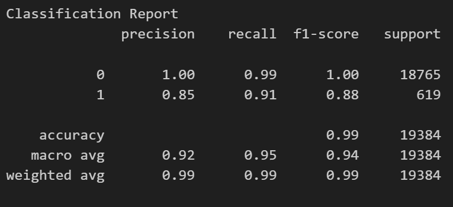

# credit-risk-classification
Module 20 Challenge

# Premise
In this challenge, I use Supervised Machine Learning (specifically a LogisticRegression model in Python using sklearn and pandas), to train and evaluate a model based on loan risk. This is derived from a dataset of historical lending activity from a peer-to-peer lending services company to build a model that can identify the creditworthiness of borrowers. 

In the files and code, a value of 0 in the “loan_status” column means that the loan is healthy. A value of 1 means that the loan has a high risk of defaulting.

# Credit Analysis Report
### Classification Report

### Analysis Overview
The purpose of this analysis is to use existing data to create a model that will predict loan risk for future borrowers, specifically flagging high-risk applicants. Data classes used to predict this include loan size, interest rate, borrower incomine, debt to income ratio, number of accounts, derogatory marks, and total debt. Applicants are given a loan status of 0 (indicidating a healthy loan) or a 1 (indicating a high-risk one). 

### Results
* Accuracy Score
    + This metric tells you how often the classifier is correct across all classes. For this model, the accuracy is 0.99 or 99%, indicating that overall, the model correctly predicts the class 99% of the time.
* Precision Score
    + Precision is the ratio of correctly predicted positive observations to the total predicted positives. It tells you how many of the instances predicted as positive are actually positive. High precision relates to a low false positive rate. For this model:
        - Class 0: The precision is 1.00, which means that 100% of the instances predicted as class 0 are indeed class 0.
        - Class 1: The precision is 0.85, meaning 85% of the instances predicted as class 1 are actually class 1, while 15% are not.
* Recall Score
    + Recall is the ratio of correctly predicted positive observations to all observations in the actual class. It tells you how many of the actual positives your model has captured through labeling it as positive. For this model:
        - Class 0: The recall is 0.99, indicating that the model correctly identified 99% of all actual class 0 instances.
        - Class 1: The recall is 0.91, indicating that the model correctly identified 91% of all actual class 1 instances.
* F1-Score
    + The F1 score is the weighted average of Precision and Recall. Therefore, this score takes both false positives and false negatives into account. It is a better measure than accuracy for imbalanced classes. For this model: 
        - Class 0: The F1-score is 1.00, suggesting a perfect balance between precision and recall for class 0.
        - Class 1: The F1-score is 0.88, indicating a good but not perfect balance between precision and recall for class 1.

### Summary
The model is performing exceptionally well in identifying class 0 with perfect precision and almost perfect recall. For class 1, the performance is also good, though there is a slight trade-off between precision and recall.

Because we're dealing with imbalanced classes, and because identifying class 1 (high-risk loans) is the most important use of the model, I'd summarize the model as 'good but not great' and would recommend further research to derive a better solution. A 15% miss on identifying high risk loans is too high to be acceptable. 

# References
* Sklearn documentation: https://scikit-learn.org/stable/modules/generated/sklearn.linear_model.LogisticRegression.html
* ChatGPT (https://chat.openai.com/) for select coding assitance.
